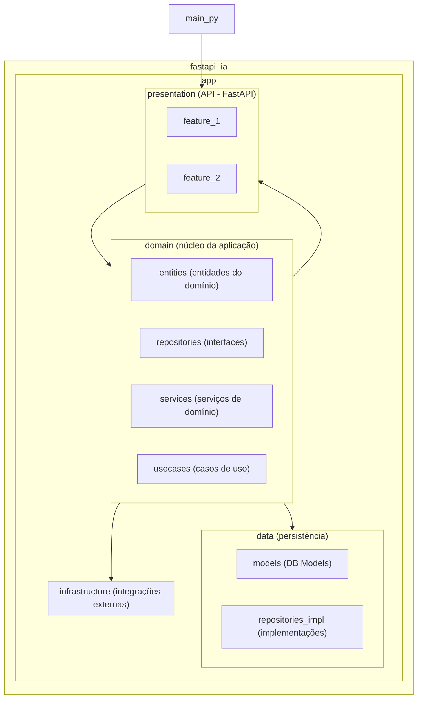

### Criar Ambiente
python3 -m venv .env

### Iniciar o ambiente
source .env/bin/activate  
deactivate

### Inicializar
uvicorn main:app --reload --root-path . 

### Endpoints

#### Age Rating Endpoint
`POST`: `/ia/age_classification`
```
{
  "text": "string"
}
```

#### Hate Speech Detection
`POST`: `/ia/hate_speech/detect`
```
{
  "text": "string"
}
```

#### Analyze Hate Speech
`POST`: `/ia/hate_speech/analyze`
```
{
  "text": "string"
}
```

### Folder Structure
```
fastapi_ia/
├── .env/                          # Arquivos de configuração de variáveis de ambiente (.env)
│
├── app/
│   ├── data/                      # Camada de persistência de dados
│   │   ├── models/                # Modelos do banco de dados (ex: SQLAlchemy)
│   │   └── repositories_impl/     # Implementações concretas das interfaces do domínio
│   │
│   ├── domain/                    # Núcleo da aplicação (regras e lógica de negócio)
│   │   ├── entities/              # Entidades do domínio (sem dependências externas)
│   │   ├── repositories/          # Interfaces (contratos) dos repositórios
│   │   ├── services/              # Serviços de domínio (lógica auxiliar e reutilizável)
│   │   ├── usecases/              # Casos de uso que orquestram as regras de negócio
│   │   └── value_objects/         # Objetos de valor (imutáveis e comparáveis por valor)
│   │
│   ├── infrastructure/            # Integrações com serviços externos (ex: Hugging Face)
│   │
│   └── presentation/              # Camada de interface (API) usando FastAPI
│       ├── feature_1/             # Módulo da feature 1: rotas, controlador e schemas
│       │   ├── controller.py      # Lógica de entrada (chama casos de uso)
│       │   ├── routes.py          # Definição das rotas da feature
│       │   └── schemas.py         # Schemas são models de entrada/saída
│       └── feature_2/             # Módulo da feature 2: rotas, controlador e schemas
│
└── main.py                        # Arquivo principal de inicialização da aplicação FastAPI
```


